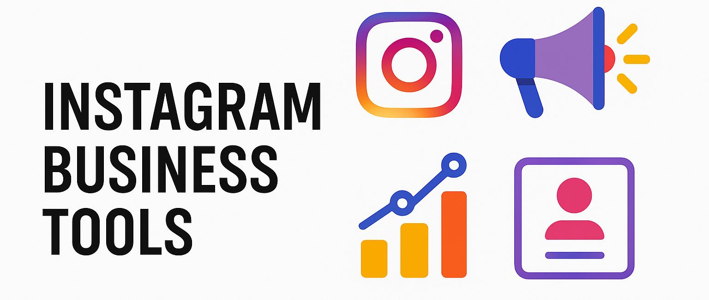

# instagram-business-tools

All-in-one toolkit for Instagram businesses — automate analytics, schedule posts, manage influencer collaborations, and integrate with CRM systems seamlessly.

<p align="center">
  <a href="https://t.me/devpilot1" target="_blank">
    
  </a>
  <a href="https://discord.gg/vBu9huKBvy" target="_blank">
    
  </a>
  <a href="https://wa.me/447723343390?text=Hi%20Zeeshan%2C%20I%27m%20interested%20in%20automation." target="_blank">
    
  </a>
  <a href="mailto:support@appilot.app" target="_blank">
    
  </a>
</p>

<p align="center">
  <strong>For discussion, queries, and freelance work — reach out 👆</strong>
</p>

---

## Introduction
> instagram-business-tools provides marketers and agencies with automation for post scheduling, CRM syncing, analytics tracking, and influencer collaboration — all in one platform.

<p align="center">
  
</p>

### Key Benefits
1. Centralized management of all Instagram business activities.  
2. Integrates with CRMs, analytics dashboards, and automation APIs.  
3. Reduces manual workload with intelligent scheduling.  
4. Enhances influencer collaborations through insights & reach tracking.  
5. Fully secure with proxy & anti-detect systems.  

---

## Features

| Feature | Description |
|----------|-------------|
| CRM Integration | Sync leads, campaigns, and performance directly into CRMs. |
| Auto Scheduling | Schedule posts, reels, and stories across multiple accounts. |
| Influencer Tracker | Track influencer campaigns, ROI, and content performance. |
| Analytics Dashboard | Visualize engagement, growth, and conversion data. |
| Multi-account Manager | Manage multiple brand accounts from a single dashboard. |

---

## Use Cases
- Agencies managing multiple business accounts.  
- Brands running influencer campaigns.  
- Social media teams analyzing engagement data.  
- Businesses integrating Instagram with CRM systems.  

---

## FAQs

**Q:** Can Instagram business tools integrate with CRM or sales systems?  
**A:** Yes, many Instagram business tools offer CRM integration through APIs, allowing automatic syncing of leads, campaign results, and conversions to platforms like HubSpot, Salesforce, or Zoho CRM.

**Q:** How do scheduling tools save money?  
**A:** Scheduling tools cut costs by automating repetitive posting tasks, reducing the need for manual social media managers, and ensuring consistent brand activity even during off-hours.

**Q:** How do Instagram tools help with influencer collaborations?  
**A:** They streamline influencer discovery, track campaign performance, and provide analytics that measure ROI, engagement, and conversions — helping brands select better partners and scale campaigns efficiently.

---

## Results
----------------------------------- 
> 5x faster content scheduling  
> 60% reduction in management time  
> 90% accuracy in campaign tracking  

## Performance Metrics
-----------------------------------
Average Performance Benchmarks:  
- **Speed:** 3x faster than manual posting  
- **Stability:** 99.4% uptime  
- **Integration Rate:** 95% CRM sync success  
- **ROI:** 2.2x return per campaign with influencer tools  

---

## Do you have a customized project for us?
Contact Us

<div align="center">
  <a href="https://mail.google.com/mail/u/?authuser=ahmadzee26@gmail.com">
    
    <code>support@appilot.app</code>
  </a>
  <span> ┃ </span>
  <a href="https://t.me/devpilot1">
    
    <code>pilot</code>
  </a>
  <span> ┃ </span>
  <a href="https://discord.com">
    
    <code>zee#2655</code>
  </a>
  <span> ┃ </span>
  <a href="https://wa.me/447723343390?text=Hi%20Zeeshan%2C%20I%27m%20interested%20in%20automation." target="_blank">
    
    <code>whatsapp</code>
  </a>
  <br />
</div>

---

## Installation

### Pre-requisites
- Node.js or Python  
- Git  
- Docker (optional)  

### Steps
```bash
# Clone the repo
git clone https://github.com/yourusername/instagram-business-tools.git
cd instagram-business-tools

# Install dependencies
npm install
# or
pip install -r requirements.txt

# Setup environment
cp .env.example .env

# Run
npm start
# or
python main.py

